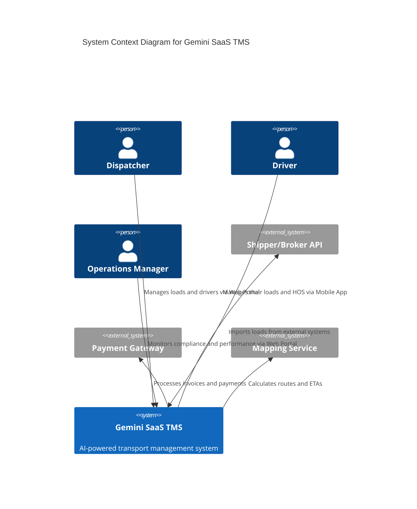

# 02. System Architecture Overview (C4 Model)

This document provides a high-level overview of the TMS architecture using the C4 model for visualizing software architecture.

## 1. Level 1: System Context Diagram

This diagram shows the TMS as a black box and its interactions with the outside world.



## 2. Level 2: Container Diagram

This diagram zooms into the TMS system and shows the high-level containers (microservices, databases, etc.) that make up the system.

```mermaid
C4Container
  title Container Diagram for Gemini SaaS TMS

  Person(user, "User", "Dispatcher, Driver, etc.")

  System_Boundary(gcp, "Google Cloud Platform") {
    Container(web_portal, "Web Portal", "React", "The main interface for dispatchers and managers")
    Container(mobile_app, "Mobile App", "React Native", "The main interface for drivers")

    System_Boundary(api_gateway, "API Gateway (Apigee)") {
      Container(api, "API", "", "The single entry point for all API requests")
    }

    System_Boundary(microservices, "Microservices (GKE)") {
      Container(company_service, "Company Service", "NestJS", "Manages companies, users, and roles")
      Container(driver_service, "Driver Service", "NestJS", "Manages drivers and HOS logs")
      Container(asset_service, "Asset Service", "NestJS", "Manages trucks and trailers")
      Container(dispatch_service, "Dispatch Service", "FastAPI", "Manages loads and assignments")
      Container(notification_service, "Notification Service", "NestJS", "Sends emails and push notifications")
    }

    System_Boundary(databases, "Databases (Cloud SQL)") {
      ContainerDb(company_db, "Company DB", "PostgreSQL", "Stores company and user data")
      ContainerDb(sharded_db, "Sharded DBs", "PostgreSQL", "Stores tenant-specific data (drivers, assets, loads)")
    }

    System_Boundary(messaging, "Messaging (Pub/Sub)") {
      Queue(event_bus, "Event Bus", "", "For asynchronous communication between services")
    }
  }

  Rel(user, web_portal, "Uses")
  Rel(user, mobile_app, "Uses")

  Rel(web_portal, api, "Makes API calls to")
  Rel(mobile_app, api, "Makes API calls to")

  Rel(api, company_service, "Routes to")
  Rel(api, driver_service, "Routes to")
  Rel(api, asset_service, "Routes to")
  Rel(api, dispatch_service, "Routes to")

  Rel(company_service, company_db, "Reads/Writes to")
  Rel(driver_service, sharded_db, "Reads/Writes to")
  Rel(asset_service, sharded_db, "Reads/Writes to")
  Rel(dispatch_service, sharded_db, "Reads/Writes to")

  Rel(company_service, event_bus, "Publishes to")
  Rel(dispatch_service, event_bus, "Publishes to")
  Rel(notification_service, event_bus, "Subscribes to")
  Rel(driver_service, event_bus, "Subscribes to")
```

## 3. Level 3: Component Diagrams

Component diagrams for each microservice will be included within the detailed DDD deep-dive documents for that service.

## 4. Level 4: Code Diagrams

Code-level diagrams (e.g., UML class diagrams) will be generated on-demand by the development agents as needed.
