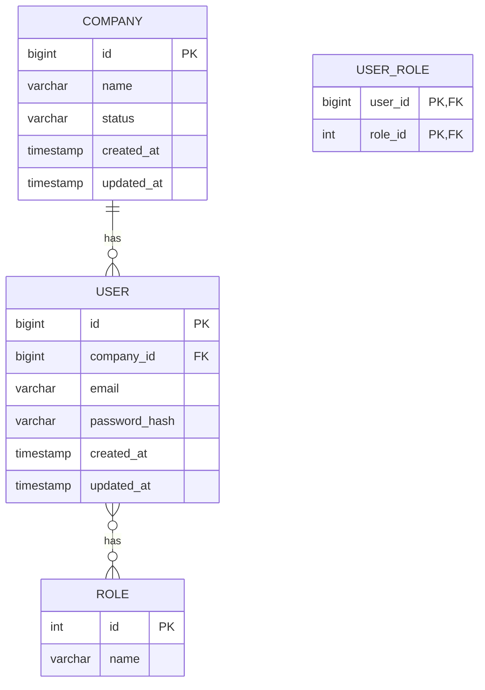
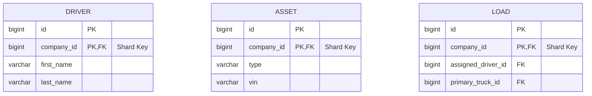

# 03. Database Architecture

## 1. The Core Principles: Sharding, Isolation, and Control

Our database architecture is designed to support a large-scale, multi-tenant SaaS application. The core principles are:

*   **Sharding by Tenant:** We use a database-per-tenant sharding model. Each tenant (company) has their data stored in a logically separate set of tables on a shared PostgreSQL instance. This provides a strong balance of data isolation and cost-effectiveness.
*   **Data Isolation is Absolute:** There are no foreign key relationships between the sharded, tenant-specific databases and the central, non-sharded `company_db`. This is a critical security and scalability constraint.
*   **Migrations are Controlled:** All schema changes are managed by a centralized, automated migration process using Flyway. There are no manual changes to the database schema.

## 2. The Sharding Strategy in Detail

1.  **The Shard Key:** The `company_id` is the shard key.
2.  **The Shard Coordinator:** An internal service, the `shard-manager-service`, is responsible for assigning new companies to shards.
3.  **The Shard Router:** Our microservices act as the shard routers. They are responsible for determining the correct database connection string for a given `company_id`.
4.  **The Sharding Process:**
    a.  A new company is created in the `company-service`.
    b.  A `company.created` event is published.
    c.  The `shard-manager-service` consumes this event.
    d.  It assigns the company to a shard and runs the full suite of Flyway migrations to create the tenant's tables on that shard.
    e.  It updates a central mapping service (e.g., Redis) with the `company_id` -> `shard_connection_string` mapping.

## 3. The Database-as-Code Workflow

This workflow is mandatory for all database changes.

1.  **Create a Migration Script:** Create a new, versioned SQL script in the `database/migrations` directory.
2.  **Write Idempotent SQL:** The SQL script must be able to be run multiple times without causing errors.
3.  **Test Locally:** Test the migration on a local Dockerized PostgreSQL instance.
4.  **Submit a Pull Request:** The migration script is reviewed and tested as part of the PR process.
5.  **Automated Deployment:** The CI/CD pipeline will automatically apply the migration to the appropriate database before deploying the application code.

## 4. The Entity-Relationship Diagrams (ERDs)

These are the logical schemas for our databases. See the individual DDD deep-dive documents for more detailed, component-level diagrams.

### `company_db` (Non-Sharded)

### Sharded Databases (`driver_db`, `asset_db`, `dispatch_db`)

All tables in the sharded databases must contain a `company_id` column which is part of the primary key.

## 5. Risks and Mitigation

*   **Hot Spots:** One tenant may become much larger than others, creating a "hot spot" on a particular shard.
    *   **Mitigation:** We will monitor shard utilization and have a plan to rebalance shards if necessary. This is a complex operation and will require a dedicated runbook.
*   **Cross-Shard Queries:** Some analytical queries may require data from multiple shards.
    *   **Mitigation:** These queries will not be run against the production databases. We will have a separate data warehousing solution (e.g., BigQuery) that aggregates data from all shards for analytical purposes.
